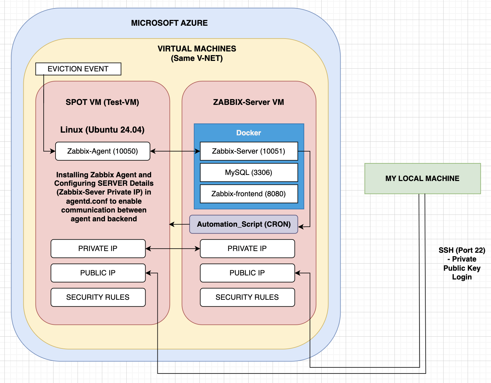

**Rayca Assessment Documentation**

**Current Scenario:**

Spot VMs are popular in Azure due to their extended features at a lower price. However, a drawback is that Azure can evict or deallocate these resources if needed to satisfy storage purposes. Although Spot VMs can be restarted, Azure does not provide an automated feature to handle this scenario.

**Objective:**

To design a cost-efficient cloud automation infrastructure using Azure and Zabbix that automatically turns on a VM every 5 minutes after it is evicted.

**Pre-requisites:**

* Microsoft Azure
* Zabbix
* Cloud Infrastructure
* Network Security
* Docker
* Virtualization
* DevOps
* Additional Help Provided:
* **Help provided to Simulate Eviction Event** (https://learn.microsoft.com/en-us/rest/api/compute/virtual-machines/simulate-eviction?view=rest-compute-2024-03-02&tabs=HTTP&tryIt=true#code-try-0)

**Design Architecture:**

In the above design, we can see that the architecture is divided into 3 major components:

* **Local Machine**:\
The Local Machine can be used to communicate with the VM's via SSH (22), perform necessary upgrades, write code and test software.

* **Zabbix-Server VM**:\
This VM consists of the Zabbix Server, MySQL database and the zabbix-frontend-nginx (Used for Dashboard).
All these components are configured through Docker-Compose (**Code available through Docker-Compose.YML**)\
It also consists of tha automation script that runs every 5 minutes as a Cron-Job.
The **VM_Public_IP:8080** will take us to the Zabbix Dashboard where we can check the status of the automation and the Zabbix Agent. Azure CLI is also configured and installed.

* **Spot-VM (VM-Test)**:\
This VM is the main Spot VM which we use to check the automation. This has the Zabbix Agent installed and running at all times.\
The zabbix_conf has got the SERVER configuration of the private ip of the Zabbix_Server VM so that the agent 
can continuously send metrics and info to the Zabbix Server.\
As soon as the VM is evicted, this triggers the restart automation for this VM.

**Project-Code:**

* docker-compose.yml

This file is located in the Zabbix-Server VM. It consists of 3 services: mySQL, Zabbix-server and Zabbix-frontend.
All the configuration is done by Zabbix Official Images (https://hub.docker.com/r/zabbix/zabbix-server-mysql) and installation done through Zabbix Official Documentation (https://www.zabbix.com/download?zabbix=6.4&os_distribution=ubuntu&os_version=24.04&components=server_frontend_agent&db=mysql&ws=apache)

  `zabbix-database:`

    image: mysql:latest
    container_name: zabbix-sql-server
    hostname: zabbix-sql-serveri
    ports:
      - "3306:3306"
    environment:
      MYSQL_ROOT_PASSWORD: Zoomisdeath@1998`

`  zabbix-server:`

    depends_on:
      - zabbix-database
    image: zabbix/zabbix-server-mysql:latest
    ports:
      - "10051:10051"
    container_name: zabbix-server
    hostname: zabbix-server
    environment:
      DB_SERVER_HOST: zabbix-sql-server
      DB_SERVER_PORT: 3306
      MYSQL_USER: root
      MYSQL_PASSWORD: Zoomisdeath@1998
    restart: unless-stopped

`zabbix-web:`

    depends_on:
      - zabbix-database
      - zabbix-server
    container_name: zabbix-web-server
    hostname: zabbix-web-server
    image: zabbix/zabbix-web-nginx-mysql:latest
    ports:
      - "8080:8080"
    environment:
      DB_SERVER_HOST: zabbix-sql-server
      DB_SERVER_DBNAME: zabbix
      ZBX_SERVER_HOST: zabbix-server
      MYSQL_USER: root
      MYSQL_PASSWORD: Zoomisdeath@1998

The sql container is spawned first, followed by the backend and the nginx-frontend respectively to setup the zabbix user and sql databases.

* automation_script.sh

This file is the main heart of the operation. It is a bash script scheduled as a **CRON JOB** to run every 5 minutes, check the status of the SPOT VM and then restart it back on.
It uses Linux server commands along with Azure CLI and Docker commands to provide an immersive automation experience.

        spot_vm_list=$(az resource list --tag zabbix-agent=spot-vm --query "[].{Name:name, ResourceGroup:resourceGroup}")
        
        echo "$spot_vm_list" | jq -c '.[]' | while IFS= read -r item; do
            # Extract values using jq
            name=$(echo "$item" | jq -r '.Name')
            resource_group=$(echo "$item" | jq -r '.ResourceGroup')
    
            # Get the VM's private IP address to check the heartbeat of the Zabbix Agent
            vm_ip_address=$(nslookup ${name} | grep 'Address:' | awk '{ print $2 }' | tail -n 1)

            # Check if the Zabbix agent is active by pinging it from the Zabbix Server Container (Exit Status Code)
            agent_active_status=$(docker exec zabbix-server sh -c "zabbix_get -s ${vm_ip_address} -k agent.ping > /dev/null 2>&1; echo \$?")
        
            if [ $agent_active_status -eq 0 ]; then
                log_with_timestamp "Zabbix Agent: ${name} is Currently Active"
            else
                log_with_timestamp "Zabbix Agent: ${name} is Inactive....attempting to start the VM"        

            # Attempt to restart the VM up to 5 times
            attempt=1
            while [ $attempt -le 5 ]; do
                az vm start -n ${name} -g ${resource_group} > /dev/null
                if [ $? -eq 0 ]; then
                    log_with_timestamp "Zabbix Agent: ${name} restarted successfully on attempt $attempt"
                    break
                else
                    log_with_timestamp "Failed to restart Zabbix Agent: ${name} on attempt $attempt"
                fi
                attempt=$((attempt + 1))
            done

The Spot-VM has a unique tag attached to it during its creation (zabbix-agent:spot-vm), this is used to identify the correct VM hostname and resource group, catch its private ip, send ping to the agent and restart the VM on if the ping is not successful.

**Results:**

**NOTE:
The proof of Output is attached with a pre-recorded video with timestamps and commentary.** 

**Conclusion:**

With this design, I was able to achieve the automation of handling Spot VM's after simulating an eviction process.
The automation code accurately checks the status of the VM every 5 minutes and restarts the VM to the original state.
This helps is to effectively handle the deployment and reduce any manual intervention by a significant ratio.

The total billing cost of this infrastructure (Used for about 20 hours cumulative for 2 VM's) is less than 1.5$ (Total Setup) which is cost-effective.

